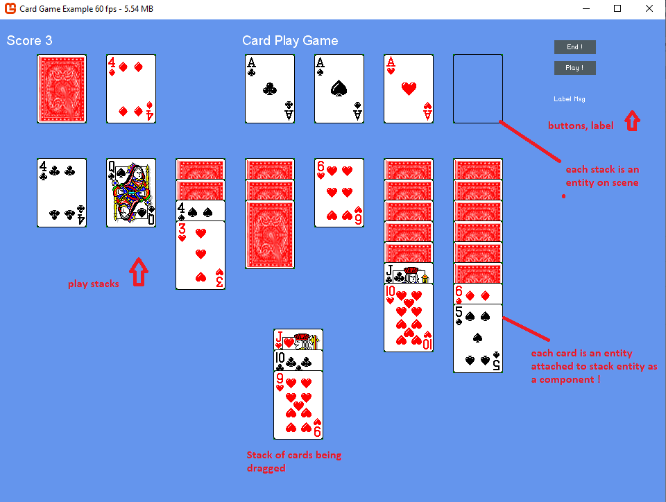

# Nez ECS Framework Sample

This is a simple solitaire card game to show how to use Nez frame work. This ECS Framework specifically made for C# and Monogame.

https://github.com/prime31/Nez

I worked with Monogame, then went to Unity, and now came back to Monogame using Nez because I like the simplicity of working with Nez on 2D games.  This is a powerful 2D game engine.

ECS is used to allow for separation of concern when coding. For example, I choose to update my components using a separate "System".  
However, You will find most examples of NEZ to be using updates inside "Components".  I don't like that.  NEZ is flexible enough to allow you to choose which way to go !!

Game uses UI Canvas to put 2 button and a label on screen.

## Sample Screen

ECS explained here https://www.gamedev.net/articles/programming/general-and-gameplay-programming/understanding-component-entity-systems-r3013/
